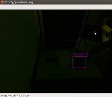
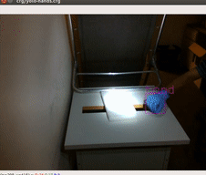
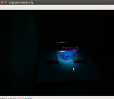
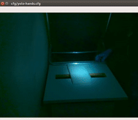
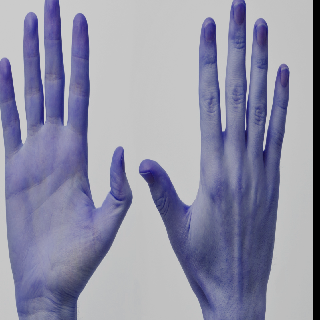
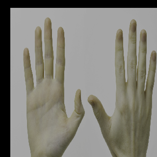
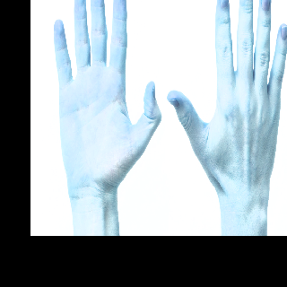

# Robust Hand Tracking using PyTorch-YOLO2 
In this repository, I use
[YOLO2](https://github.com/marvis/pytorch-yolo2) and Gamma Correction to
compile a robust hand tracker. The objective of this project was to make
a hand tracker that will work in operation-room environments where there
will be extreme lighting conditions and the surgeons will be wearing
various colored gloves with blood on them.

## Demos
Please watch my [video demonstration](https://youtu.be/Khy8U_zXDC4).
Following is a simple demo of the performance of the tracker. Note that
the tracker not only works for any colored hands but also for different
gloves too.

 

I further demonstrate the robustness of the tracker by varying room
lighting, adding a very bright light and lowering the camera exposure.
For my experiments, I have used Intel Realsense D435i camera.

#### Room Lights: off, Bright Lights: off, Exposure: Normal
Even in the dark the tracker works well.  
 

#### Room Lights: on, Bright Lights: on, Exposure: Normal 
Hand can't be tracked anymore where the lighting is too intense.  
 

#### Room Lights: on, Bright Lights: on, Exposure: Low
Camera exposure is lowered to handle bright light. Now, in the bright
area the hand can be tracked but the rest of the image gets so dark that
tracker fails.  
 

#### Room Lights: on, Bright Lights: on, Exposure: Low, Gamma Correction: on
To brighten the image, gamma correction is applied. As a result, the
tracker can now track hands both inside and outside of the high
intensity lighting region.  
 

## Training
### Dataset
I trained the yolo network on the
[Egohands Dataset](http://vision.soic.indiana.edu/projects/egohands/).
It contains high quality, pixel level annotations (>15000 ground truth
labels) where hands are located across 4800 images. All images are
captured from an egocentric view (Google glass) across 48 different
environments (indoor, outdoor) and activities (playing cards, chess,
jenga, solving puzzles etc).

I modified the codes provided in this
[repository](https://github.com/victordibia/handtracking) to be able to
download and organize data in yolo2 training data style.
egohands_2_yolo-conversion.py is the code for getting the dataset. Use
this code to extract the dataset in yolo2 style in your desired forlder
by changing the "dest_dir" variable in the code.

Example of data augmentation implemented in yolo's training codes and a
little addition of mine (discussed later) are given below. The leftmost
image is the original image. The rest are augmentations. Due to this
augmentation, the dataset becomes very randomized which in turn helps
achieve well generalized network weights.

 

#### Modifications in Original YOLO Codes
I did a some modifications of the original codes provided by
[marvis](https://github.com/marvis/pytorch-yolo2). I modified the
load_data_detection() of the image.py file. Instead of using image.py, I
used image_edited.py in the dataset.py file. The change is the addition
of another data augmentation step. Now the function randomly opens the
training image in RGB or BGR format. If you want, you can change back to
image.py in dataset.py.

Next, I modified the training code. I used the "training_debug.ipynb"
notebook for training. I added
[livelossplot](https://github.com/stared/livelossplot) to plot the
training loss varying with time. This gives an easier understanding of
training status.

## Instructions
Use the following codes to work with this repository.
* egohands_2_yolo-conversion.py: Use this to download the dataset in
  your desired folder in yolo2 training data style. Modify the
  "dest_dir" variable in the code for setting the destination directory.
* train.py or training_debug.ipynb: use either of these codes to train
  your network. If the latter is used then set the datacfg, cfgfile and
  weightfile variables accordingly in the notebook.
* For demo using a webcam, use demo.py.
* For demo using a Intel Realsense camera, use
  demo_realsense_gamma_analysis.py. This also allows for turning on
  gamma correction and changing the exposure level of the camera. Change
  the exposure_val, gamma_val and gamma_correction variables in the code
  for this.
* My trained weight can be downloaded from my
  [Dropbox](https://www.dropbox.com/sh/l7owplz9rzwbc5l/AAAt29mXBUNQWM5JGbEk_j2Ra?dl=0).
  Copy the "hands" folder into the "backup" folder for using it in the
  demos.
* Use image_augmentation_demo.py for demos of the image augmentation
  results implemented in yolo.

